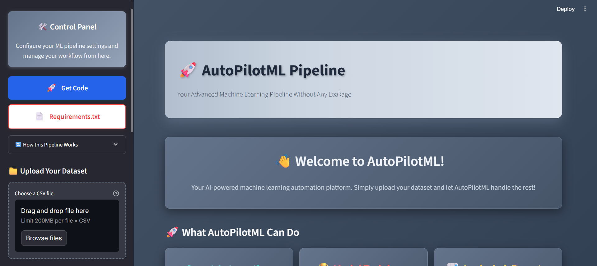
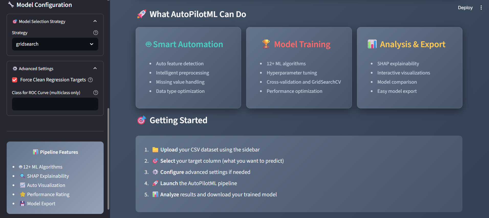
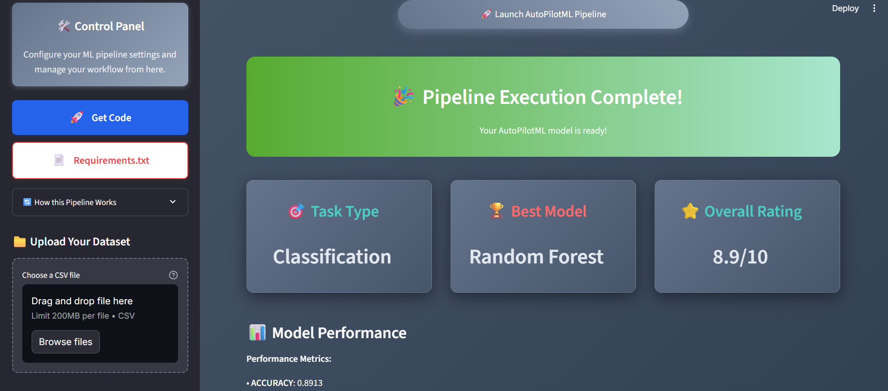
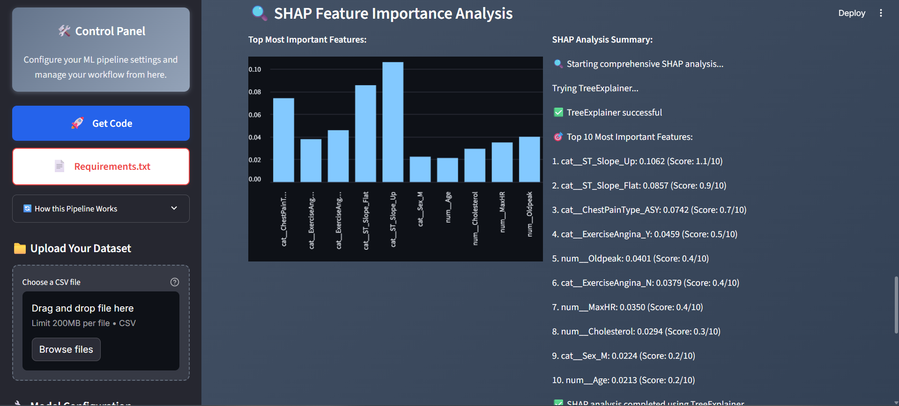

# AutoPilotML

Upload a CSV. Pick a strategy. Get a trained, explained model — no code required.

AutoPilotML is an end-to-end AutoML pipeline with a two-phase architecture: fast baseline modeling with SHAP-driven feature refinement, followed by exhaustive hyperparameter tuning across 12+ algorithms.

---

## How it works

### Phase 1 — Baseline on Preprocessed Data
The dataset is preprocessed first (cleaning, encoding, scaling). Three baseline models are then trained on the processed data. If the best model meets an accuracy threshold, the pipeline stops — no further computation needed. If not, SHAP is run on the best baseline model to identify low-importance features, additional preprocessing is applied, and the pipeline moves to Phase 2.

### Phase 2 — Full Model Search (triggered only if Phase 1 threshold not met)
12+ algorithms (Random Forest, XGBoost, LightGBM, SVM, and more) are trained with GridSearchCV hyperparameter tuning. The final model is selected based on the user's chosen strategy:

| Strategy | How it picks the best model |
|---|---|
| `gridsearch` | Full tuning across all models — most thorough |
| `accuracy` | Highest score, no time consideration |
| `utility` | 70% accuracy weight + 30% speed weight |

Task type (classification vs regression) is detected automatically from the target column.

---

## Features

- Supports classification and regression tasks
- Automatic task detection from target column
- SHAP feature importance plots for the final model
- ROC curve support for multiclass classification
- Force-clean regression targets option for noisy datasets
- Streamlit UI — no code required

---

## Screenshots

| Upload & Control Panel | Model Configuration | Pipeline Results | SHAP Analysis |
|---|---|---|---|
|  |  |  |  |

---

## Tech Stack


---

## Getting Started

```bash
git clone https://github.com/DhruvKarani/AutoPilotML.git
cd AutoPilotML
pip install -r requirements.txt
streamlit run app.py
```

Then open `http://localhost:8501` in your browser.

---

## Usage

1. Upload a CSV dataset
2. Select the target column
3. Choose a model selection strategy (`gridsearch`, `accuracy`, or `utility`)
4. Run — the pipeline handles everything from feature refinement to final model selection
5. View metrics, SHAP plots, and download the best model

---

## Project Structure

```
AutoPilotML/
│
├── app.py                  # Streamlit UI
├── automl_pipeline.py      # Core pipeline — Phase 1 + Phase 2
├── analyze_datasets.py     # Dataset analysis utilities
├── saved_models/           # Trained model outputs
├── Datasets/               # Sample datasets
└── Automatic_ML_Pipeline(Advanced).ipynb  # Notebook version
```

---

## Author

**Dhruv Karani** · [LinkedIn](https://www.linkedin.com/in/dhruv-karani-06a03229a/)
